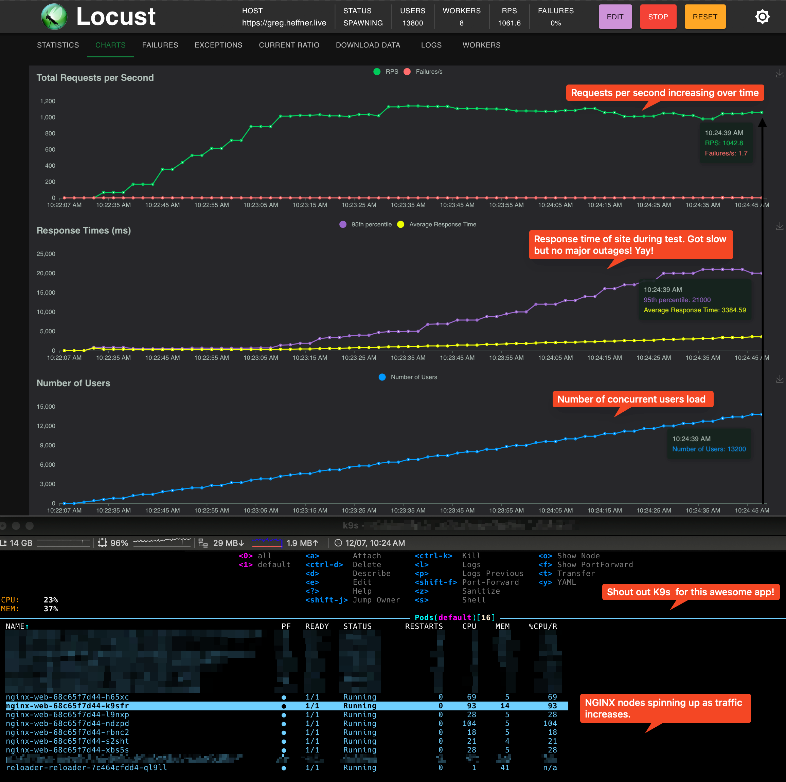

# Locust App


This README will guide you through the process of downloading and configuring the Locust app.

## Blog
Check out the blog write-up about this at https://greg.heffner.live/image/pages/2024/Sept/smoketest.html

## Downloading Locust

First, download my repo and Locust app from the official repository and run it:
```sh
git clone https://github.com/gregheffner/locust.git
cd locust
```
```sh
pip install locust
```

## Usage

To start the Locust workers on a Mac M2 with 8 cores, use the following commands:

```sh
chmod + x start_workers.sh && /.start_workers.sh
```
```sh
locust -f locustfile.py --worker --master-host=127.0.0.1 --expect-workers=8
```
```sh
Starting web interface at http://0.0.0.0:8089
```

## Load Test Results

Here is an example of the load test results:



## Documentation

For more detailed information, please refer to the [official Locust documentation](https://docs.locust.io/en/stable/).
